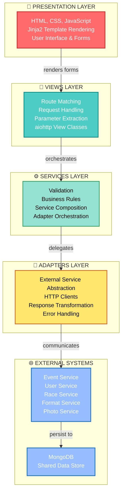

# Architecture Overview

## System Design Principles

The Event Service GUI follows a **layered architecture pattern** with clear separation of concerns across four distinct layers:



## Architectural Goals

### 1. **Modularity**
- Each service adapter is independently testable
- Views are loosely coupled to underlying data structures  
- Services enforce business logic boundaries
- Clear responsibility separation

### 2. **Asynchronicity**
- All I/O operations are non-blocking using async/await
- Efficient handling of concurrent user sessions
- Improved throughput and responsiveness
- aiohttp for async HTTP client and server

### 3. **Maintainability**
- Clear separation of concerns across layers
- Adapter pattern for external integrations
- Configuration-driven behavior via environment variables
- Consistent error handling patterns

### 4. **Scalability**
- Stateless design enables horizontal scaling
- JWT-based authentication (no session affinity needed)
- Load balancer compatible
- Connection pooling for external services

## Request Processing Flow

```
1. User Action (Browser)
        ↓
2. HTTP Request arrives at Gunicorn/aiohttp server
        ↓
3. View Layer
   ├─ Route matching (URL → View class)
   ├─ Parameter extraction from URL/form/JSON
   ├─ Session/Authentication check
   └─ Call appropriate Service
        ↓
4. Service Layer (Business Logic)
   ├─ Validate input parameters
   ├─ Apply business rules and validation
   ├─ Coordinate multiple adapters if needed
   ├─ Transform data for adapter calls
   └─ Delegate to Adapters
        ↓
5. Adapter Layer (Integration)
   ├─ Build HTTP request to external service
   ├─ Include authentication headers (JWT)
   ├─ Parse response JSON
   ├─ Handle errors (retry, timeout, validation)
   └─ Return typed response
        ↓
6. External Microservice
   └─ Process request, access MongoDB, return data
        ↓
7. Response bubbles back through layers
        ↓
8. Template Rendering
   ├─ Render Jinja2 template with returned data
   ├─ Apply CSS styling
   ├─ Include inline JavaScript
   └─ Generate HTML
        ↓
9. HTTP Response to Browser
        ↓
10. Browser renders HTML to user
```

## Core Components

### Views (`views/`)
- HTTP request handlers using aiohttp's `View` class
- One view class per major feature area (Events, Raceplans, Contestants, etc.)
- Responsibilities:
  - Route matching and HTTP method handling
  - Session and authentication validation
  - Parameter extraction and validation
  - Service layer invocation
  - Template rendering

### Services (`services`)  
- Business logic orchestration
- Data validation before persistence
- Adapter coordination (calling multiple adapters for complex operations)
- Transaction-like semantic handling
- Acts as a facade to simplify view layer

### Adapters (`services/*_adapter.py`)
- Abstract external microservice HTTP APIs
- Implement the **Adapter design pattern**
- One adapter per external service (EventsAdapter, UserAdapter, etc.)
- Responsibilities:
  - Construct HTTP requests
  - Handle authentication/authorization headers
  - Timeout and retry logic
  - Response parsing and validation
  - Error transformation to exceptions

### Templates (`templates/`)
- Jinja2 template files for HTML rendering
- Presentation logic (loops, conditionals, formatting)
- CSS styling (inline or external)
- Client-side JavaScript for interactivity
- Template inheritance for code reuse

### Configuration (`event_service_gui/config/`)
- JSON files for static configuration
- `global_settings.json` - System settings
- `sports_clubs.json` - Club definitions
- `competition_format_*.json` - Competition rule templates

## Design Patterns Used

### 1. **Adapter Pattern**
Isolate external service dependencies in adapter classes. This allows:
- Views and Services don't know implementation details of external APIs
- Easy to mock adapters in tests
- Changes to external APIs contained to adapter layer
- Clear contract between layers

### 2. **Facade Pattern**
Services provide simplified interfaces to complex multi-adapter operations:
- Complex workflows hidden from views
- Consistent error handling
- Reusable across multiple views
- Single responsibility concept

### 3. **MVC Pattern (Conceptual)**
- Views = Template files (presentation logic)
- Controller = View classes in views/ (routing + orchestration)
- Model = Service layer (business logic) + Adapters (data access)

### 4. **Template Method Pattern**
Jinja2 template inheritance provides:
- Base templates define overall page structure
- Specific pages inherit and override blocks
- Consistent UI across pages
- DRY principle for common elements

### 5. **Decorator Pattern** (Python)
Decorators for cross-cutting concerns:
- `@check_login_open` - Authentication validation
- `@require_role()` - Authorization checks
- Composable and reusable across views

## Key Technologies

| Component | Technology | Purpose |
|---|---|---|
| **Framework** | aiohttp | Async HTTP web framework |
| **Language** | Python 3.13+ | Implementation language |
| **Templates** | Jinja2 | HTML template rendering |
| **Authentication** | JWT | Token-based authentication |
| **Sessions** | Encrypted Cookies | Session state storage |
| **Database** | MongoDB | Persistent data (via microservices) |
| **Server** | Gunicorn | WSGI/application server |
| **Async Runtime** | asyncio | Python async event loop |

## Authentication & Authorization Flow

### Login Process
```
1. User POST login form (username, password)
       ↓
2. UserAdapter.login_user() → User Service
       ↓
3. User Service validates credentials
       ↓
4. Returns JWT token (30-60 min expiry)
       ↓
5. GUI stores JWT in encrypted session cookie
       ↓
6. Token stored in browser (in encrypted cookie)
```

### Token Validation
```
Every Protected Request:
1. Extract token from session cookie
2. Include in Authorization header: 'Bearer {token}'
3. Service calls may re-validate with User Service
4. Invalid/expired token → redirect to login
```

### Authorization
- Role-based (inferred from User Service data)
- Each view checks `check_login_open()` decorator
- Some views may have additional role checks

## Error Handling Strategy

### Multi-Layer Error Handling
```
Try to prevent errors early:
1. View Layer
   ├─ Malformed requests rejected
   ├─ Parameters validated
   └─ Authentication checked

2. Service Layer
   ├─ Business rule violations caught
   ├─ Data validation errors raised
   └─ Complex operation failures handled

3. Adapter Layer
   ├─ Network errors (connection refused)
   ├─ Timeouts handled with retries
   ├─ Invalid responses detected
   └─ External service errors transformed

4. Global Error Handler
   ├─ Uncaught exceptions logged
   ├─ User-friendly error messages
   └─ Error logging for debugging
```

### Error Types
- **Validation Errors**: User input invalid
- **Authentication Errors**: Token missing/invalid
- **Authorization Errors**: User lacks permission
- **Service Errors**: External service unavailable
- **Data Errors**: Inconsistent data received

## Concurrency & Async Handling

### Async Everything
- All I/O operations are async (no blocking calls)
- External service calls don't block user requests
- Gunicorn worker can handle many concurrent requests
- Python asyncio event loop manages execution

### Benefits
- Single worker handles 100+ concurrent users
- No thread management complexity
- Clean async/await syntax
- Efficient resource usage

## Configuration Management

### Levels (Priority Order)
```
1. Environment Variables (highest)
   ├─ Service endpoints
   ├─ Credentials and secrets
   └─ Feature flags
   
2. JSON Config Files
   ├─ Static application settings
   ├─ Club definitions
   └─ Competition format templates
   
3. Code Defaults (lowest)
   └─ Fallback values
```

### Multi-Environment Support
Same code, different configurations:
- **Development**: localhost services, DEBUG logging
- **Staging**: Real service hostnames, INFO logging
- **Production**: Production endpoints, WARNING logging, SSL/TLS

## Performance Considerations

### Caching Opportunities
- Session data (already cached in encrypted cookie)
- Configuration files (load once on startup)
- Static assets (browser caching)
- Consider Redis for distributed caching

### Connection Management
- aiohttp session pooling across requests
- Connection timeouts configured
- Retry logic for transient failures
- Graceful degradation on service unavailability

### Load Handling
- Async request handling enables high concurrency
- Gunicorn worker pool scales to CPU count
- Load balancer distributes across instances
- Database connection pooling

## Security Architecture

### At a Glance
```
HTTPS/TLS
    ↓
Load Balancer (SSL termination)
    ↓
Web Server (Gunicorn)
    ↓
Encrypted Session Cookies
    ↓
JWT Token Validation
    ↓
Role-Based Authorization
```

### Key Security Features
- HTTPS/TLS for all external communications
- JWT tokens for stateless authentication
- Encrypted session cookies (Fernet encryption)
- Environment variable secrets (not in code)
- Async operations prevent timing attacks
- Input validation prevents injection attacks

## Deployment Topology

### Development
Single machine with all services locally via Docker Compose

### Production
```
Users
  ↓ HTTPS:443
Load Balancer (NGINX)
  ↓ HTTP:8080
[GUI Instance 1]
[GUI Instance 2]
[...N instances]
  ↓
Microservices
  ├─ Event Service
  ├─ User Service
  ├─ etc.
  ↓
MongoDB Replica Set
```

## Future Architectural Considerations

### Near-term Enhancements
- Redis caching layer
- WebSocket for real-time race updates (instead of polling)
- GraphQL API (alternative to REST)
- Message queue for async tasks

### Longer-term Evolutions
- API Gateway (centralized authentication)
- Service Mesh (Istio, Linkerd)
- Circuit Breakers (resilience)
- Event-driven architecture (event bus)
- CQRS pattern if read/write scaling needed

## Key Metrics

- **Concurrent Users**: 100-1000 per instance (async)
- **Response Time**: 100-500ms median (depends on adapters)
- **Throughput**: ~10-50 requests/sec per instance
- **Availability**: 99.5%+ with proper deployment

---

**Next**: Review [C4 Context Diagram](02_c4_context.md) to see system scope and external systems.
