# C4 Context Diagram: System Scope

## What is C4 Context?

The **C4 Context diagram** shows:
- The system being documented (Event Service GUI)
- Who uses it (actors/users)
- What external systems it interacts with
- High-level data flows

## Functional Context (Business View)

What does the system actually do? Here's the functional perspective without technical detail:

```mermaid
graph TB
    subgraph Admin["👤 Event Administrator"]
        Director["Race Director<br/>Event Organizer<br/>Competition Manager"]
    end
    
    subgraph System["🎯 Event Service GUI<br/>Sports Event Administration Platform"]
        direction TB
        
        subgraph EventMgmt["📅 Event Management"]
            Events["Create & Configure Events"]
            Settings["Event Settings & Rules"]
        end
        
        subgraph ContestantMgmt["👥 Competitor Management"]
            Register["Register Competitors"]
            Assign["Assign to Race Classes"]
            Seeding["Generate Seedings"]
        end
        
        subgraph RaceMgmt["🏁 Race Execution"]
            Planning["Plan Races & Schedules"]
            Control["Control Races Live"]
            Timing["Track Timing & Results"]
        end
        
        subgraph ResultsMgmt["📊 Results & Reporting"]
            Calculate["Calculate Results"]
            Publish["Publish Standings"]
            Reports["Generate Reports"]
        end
        
        subgraph AdminTools["🔧 Administration"]
            Users["Manage Users"]
            Permissions["Control Permissions"]
            Config["System Configuration"]
        end
    end
    
    Director -.uses.- System
    
    classDef user fill:#50C878,stroke:#2D7A4A,stroke-width:2px,color:#fff
    classDef system fill:#4A90E2,stroke:#2E5C8A,stroke-width:3px,color:#fff
    classDef feature fill:#95E1D3,stroke:#0A8A84,stroke-width:2px,color:#000
    
    class Director user
    class System system
    class Events,Settings,Register,Assign,Seeding,Planning,Control,Timing,Calculate,Publish,Reports,Users,Permissions,Config feature
```



**Key Capabilities**:
- ✅ Complete event lifecycle management
- ✅ Competitor registration and organization
- ✅ Automated race scheduling and seeding
- ✅ Live race monitoring and control
- ✅ Real-time result calculation and publication
- ✅ User and permissions management

---

## Technical Context (System Integration View)

```mermaid
graph TB
    subgraph Users["👤 Users"]
        Admin["Event Administrator<br/>(Race Director, Organizer)<br/>Manages events, raceplans,<br/>competitors, and results"]
    end
    
    subgraph WebTech["🌐 Client Technology"]
        Browser["Web Browser<br/>(Chrome, Firefox, Safari, Edge)"]
    end
    
    subgraph SystemBoundary["🏢 Event Service GUI System"]
        direction TB
        GUI["<b>Event Service GUI</b><br/>Web-based Administration Interface<br/>aiohttp • Python 3.13+<br/>Jinja2 Templates • JWT Auth"]
    end
    
    subgraph Services["🔧 Microservices Ecosystem"]
        direction TB
        EventSvc["📊 Event Service<br/>Core event & race data<br/>Port: 8082"]
        UserSvc["👥 User Service<br/>Authentication & users<br/>Port: 8086"]
        RaceSvc["🏁 Race Service<br/>Race execution & timing<br/>Port: 8088"]
        FormatSvc["⚙️ Competition Format Service<br/>Rules & algorithms<br/>Port: 8094"]
        PhotoSvc["📸 Photo Service<br/>Event photography<br/>Port: 8090"]
    end
    
    subgraph DataStore["💾 Data Store"]
        MongoDB["MongoDB<br/>Shared Data Repository<br/>Port: 27017"]
    end
    
    Admin -->|"uses web browser"| Browser
    Browser -->|"HTTP/HTTPS (Port 8080)"| GUI
    GUI -->|"REST API (JSON)"| EventSvc
    GUI -->|"REST API (JSON)"| UserSvc
    GUI -->|"REST API (JSON)"| RaceSvc
    GUI -->|"REST API (JSON)"| FormatSvc
    GUI -->|"REST API (JSON)"| PhotoSvc
    EventSvc -->|"reads/writes"| MongoDB
    UserSvc -->|"reads/writes"| MongoDB
    RaceSvc -->|"reads/writes"| MongoDB
    FormatSvc -->|"reads/writes"| MongoDB
    PhotoSvc -->|"reads/writes"| MongoDB
    
    classDef user fill:#50C878,stroke:#2D7A4A,stroke-width:2px,color:#fff
    classDef system fill:#4A90E2,stroke:#2E5C8A,stroke-width:3px,color:#fff
    classDef service fill:#FF9500,stroke:#994D00,stroke-width:2px,color:#fff
    classDef database fill:#EE5A6F,stroke:#8A2335,stroke-width:2px,color:#fff
    classDef browser fill:#9B59B6,stroke:#6C3A6F,stroke-width:2px,color:#fff
    
    class Admin user
    class Browser browser
    class GUI system
    class EventSvc,UserSvc,RaceSvc,FormatSvc,PhotoSvc service
    class MongoDB database
```



## Users/Actors

### **Event Administrator**
**Who**: Race directors, event organizers, competition administrators

**Responsibilities**:
- Create and configure events
- Define race classifications
- Register and manage competitors
- Generate race schedules and draws
- Control races in real-time
- View and publish results
- Manage event staff and permissions

**Access**: Web browser, authenticated via login

**Frequency**: Throughout event (days to weeks)

### **Spectators / Results Viewers** (Optional)
May view results and event information (read-only)

## System Responsibilities

### What Event Service GUI Does ✅

1. **Event Management**
   - Create and configure sporting events
   - Define competition rules and formats
   - Manage event settings

2. **Competitor Registration**
   - Register athletes and competitors
   - Validate participant data
   - Assign to race classes

3. **Race Planning**
   - Generate race schedules
   - Create heats and seeding
   - Assign lanes and starting positions

4. **Race Execution Support**
   - Real-time race monitoring
   - Competitor start tracking
   - Live result display

5. **Result Management**
   - View calculated results
   - Generate reports
   - Publish final standings

6. **Administration**
   - User account management
   - Role-based access control
   - System configuration

### What Event Service GUI Does NOT Do ❌

- **Store business data directly** (delegates to microservices)
- **Execute timing capture** (Race Service handles device input)
- **Send notifications** (future enhancement)
- **Process payments** (out of scope)
- **Capture photos** (Photo Service receives uploads)
- **Store competitive data permanently** (delegates to microservices)

## External Systems & Dependencies

### **1. Event Service**
**Type**: Microservice REST API  
**Port**: 8082 (default)  
**Purpose**: Core event and race data management

**Interactions**:
- GET/POST/PUT events
- Get raceclasses for event
- Create/manage competitors
- Store event metadata

**Data Format**: JSON

**Failure Impact**: 🔴 Critical - Cannot manage events

---

### **2. User Service**
**Type**: Microservice REST API  
**Port**: 8086 (default)  
**Purpose**: User authentication and management

**Interactions**:
- POST login (authentication)
- Validate JWT tokens
- Get user profile
- Manage permissions

**Data Format**: JSON + JWT tokens

**Authentication**: JWT Bearer tokens

**Failure Impact**: 🔴 Critical - Cannot authenticate users

---

### **3. Competition Format Service**
**Type**: Microservice REST API  
**Port**: 8094 (default)  
**Purpose**: Competition rule definitions and templates

**Interactions**:
- Get competition format definitions
- Get seeding algorithm implementation
- Calculate heats and qualifications

**Data Format**: JSON

**Failure Impact**: 🟡 High - Seeding won't work, but UI still visible

---

### **4. Race Service**
**Type**: Microservice REST API  
**Port**: 8088 (default)  
**Purpose**: Race execution, timing, and result calculation

**Interactions**:
- Create/manage race plans
- Manage individual race starts
- Receive timing events
- Calculate race results

**Data Format**: JSON

**Frequency**: Continuous during races (polling every 1-2 seconds for updates)

**Failure Impact**: 🔴 Critical - Live race control unavailable

---

### **5. Photo Service**
**Type**: Microservice REST API  
**Port**: 8090 (default)  
**Purpose**: Event photo management and storage

**Interactions**:
- Upload event photos
- View photo galleries
- Tag photos with race/competitor info

**Data Format**: Multipart JSON + image files

**Failure Impact**: 🟢 Low - Photography feature unavailable but not critical

---

### **6. MongoDB**
**Type**: NoSQL Database  
**Accessed By**: All microservices  
**Purpose**: Shared data store for all microservices

**Data Stored**:
- Events and competitions
- Users and permissions
- Race schedules
- Results and timing data
- Photos and metadata

**GUI Access**: Indirect (only via microservices)

**Failure Impact**: 🔴 Critical - No data available

## Data Flows

### Example: User Creates an Event

```
1. Admin opens web browser → GUI login page
2. Admin enters username/password
3. GUI (View) sends POST /login
4. GUI calls UserAdapter.login()
5. UserAdapter calls User Service API
6. User Service validates, returns JWT token
7. GUI stores token in session cookie
8. Admin navigates to create event page
9. Admin fills event form, clicks Submit
10. GUI (View) calls EventService.create_event()
11. EventService validates input
12. EventService calls EventsAdapter.create_event()
13. EventsAdapter calls Event Service API with JWT token
14. Event Service validates, stores in MongoDB, returns event ID
15. Response flows back through layers
16. GUI renders confirmation page with new event details
17. Browser displays success message
```

### Example: Live Race Updates (Polling)

```
Race is running:
Every 1 second:
1. Browser in Control view polls time-events
2. GUI View.get() called
3. Calls TimeEventsAdapter.get_recent_events()
4. Adapter calls Race Service API
5. Race Service returns new timing events
6. Results calculated (if applicable)
7. Template re-rendered with live results
8. HTML sent to browser
9. JavaScript updates display
10. User sees live competitor times
```

## Communication Protocols

### Client ↔ GUI (HTML, HTTP/HTTPS)
- **Protocol**: HTTP/HTTPS
- **Port**: 8080 (HTTP) or 443 (HTTPS via reverse proxy)
- **Method**: Request/Response
- **Content-Types**: HTML, JSON, Form-encoded

### GUI ↔ Microservices (REST/JSON)
- **Protocol**: HTTP (internal network)
- **Ports**: 8082, 8086, 8088, 8090, 8094
- **Method**: Request/Response (REST)
- **Content-Type**: JSON
- **Authentication**: JWT Bearer tokens
- **Async**: Yes (non-blocking calls)

### Microservices ↔ MongoDB
- **Protocol**: MongoDB Wire Protocol
- **Port**: 27017 (default)
- **Access**: Native MongoDB driver

## Service Discovery

### Configuration Method
- **Environment Variables** (deployment-time)
  - `EVENTS_HOST_SERVER` + `EVENTS_HOST_PORT`
  - `USERS_HOST_SERVER` + `USERS_HOST_PORT`
  - etc.

### Development
- All services on `localhost`
- Service ports hardcoded (8082, 8086, etc.)

### Production
- Services accessible by hostname (not IP)
- DNS resolution for service discovery
- Load balancers distribute requests

## System Boundaries

### Inside the Boundary (GUI Scope)
✅ Presentation layer (templates)  
✅ Request routing (views)  
✅ Business logic orchestration (services)  
✅ Service abstraction (adapters)  
✅ User authentication/authorization  
✅ Session management  
✅ Configuration loading  

### Outside the Boundary (Not GUI Responsibility)
❌ Event data persistence (Event Service)  
❌ User credential validation (User Service)  
❌ Competition rule algorithms (Format Service)  
❌ Race timing capture (Race Service)  
❌ Photo storage (Photo Service)  
❌ Database management (MongoDB)  

## Deployment Context

### What Gets Deployed
- Event Service GUI container image
- Docker image contains: Python runtime, aiohttp, Jinja2, all code
- Configuration via environment variables
- Static assets (CSS, images)

### What Doesn't Get Deployed (Pre-existing)
- Backend microservices
- MongoDB database
- Load balancers
- Reverse proxies

## Integration Assumptions

### Assumptions Made
1. ✅ All microservices available at configured endpoints
2. ✅ MongoDB accessible to all microservices
3. ✅ JWT token format compatible with User Service
4. ✅ API contract stability with external services
5. ✅ Network connectivity between containers/services

### Failure Scenarios
- If Event Service unavailable → Cannot fetch events
- If User Service unavailable → Cannot authenticate
- If Race Service unavailable → Cannot manage races
- If MongoDB unavailable → All services fail
- If network partitioned → All remote calls fail

## Technology Decisions

### Why aiohttp?
- Async-first framework
- Non-blocking I/O for concurrency
- Built-in session management
- Lightweight runtime

### Why MongoDB?
- Used by all microservices (shared data store)
- Flexible schema (sports domain is evolving)
- Scalable to large result sets
- Good for document storage

### Why JWT?
- Stateless authentication
- Enables horizontal scaling
- Industry standard
- Time-limited token expiry

## Context Diagram Interpretation

The context diagram shows:

1. **One Actor** (Event Administrator or similar)
   - Interacts solely through web browser
   - Same person viewing live events and managing registrations

2. **One System** (Event Service GUI)
   - Central hub for event administration
   - Orchestrates calls to microservices
   - Stateless and scalable

3. **Five External Systems** (Microservices)
   - Independent deployment
   - Own databases or shared MongoDB
   - Expose REST APIs
   - Can fail independently

4. **Data Flows**
   - Browser → GUI: Forms and HTTP requests
   - GUI → Microservices: REST API calls
   - Microservices → MongoDB: Data persistence
   - GUI ← Microservices: JSON responses
   - Browser ← GUI: HTML pages

## Understanding System Boundaries

### Context Level
Asks: "What is this system?"  
Answer: "Web interface for managing sporting events"

### Container Level
Asks: "How does it work?"  
Answer: "Web app + loadbalancer + database cluster"

### Component Level
Asks: "What parts does it have?"  
Answer: "Views, Services, Adapters, Templates"

### Code Level
Asks: "How is it built?"  
Answer: "Python classes, async functions, REST clients"

This diagram represents the **Context level** of the C4 model.

---

**Next**: Review [C4 Container Diagram](03_c4_container.md) to understand the internal containers and technologies.
